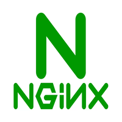

# Deliverable 1 Submission

## Basic Terminology

### What is a web server?
A web server is both a hardware and software solution that serves content, like web pages, to end-users over the internet. The hardware hosts the software capable of using protocols (mainly HTTP) to deliver this content.

### What is Apache?
Apache, also known as Apache HTTP server, is a widely-used web server software that is open-source and maintained by the Apache Software Foundation. It is known for its role in the initial growth of the World Wide Web.

### What are some different web server applications?

| Application Name   | License            | Project's Website                |
| ------------------ | ------------------ | -------------------------------- |
| Apache HTTP Server | Apache License 2.0 | [Apache](https://apache.org)     |
| Nginx              | BSD-like license   | [Nginx](https://nginx.org)       |
| Microsoft IIS      | Proprietary        | [Microsoft IIS](https://iis.net) |

#### Apache HTTP Server
 
Apache is a free and open-source cross-platform web server software, released under the terms of Apache License 2.0. It is arguably the most popular web server in use today.

#### Nginx
 
Nginx is a web server that can also be used as a reverse proxy, load balancer, and HTTP cache. It uses a non-threaded, event-driven architecture which enables it to provide high performance and scalability.

#### Microsoft IIS
 
Microsoft Internet Information Services (IIS) is a set of Internet-based services for servers using Microsoft Windows. It is an extensible web server created by Microsoft for use with Windows NT family.

### What is virtualization?
Virtualization is the technology that allows you to create multiple simulated environments from a single physical hardware system, known as virtual machines (VMs). This technology is used to consolidate hardware and improve efficiency.

### What is VirtualBox?
 
VirtualBox is a free, open-source hypervisor developed by Oracle Corporation. It allows users to run multiple guest operating systems on a single host machine.

### What is a virtual machine?
A virtual machine is a software emulation of a physical computer, which runs an operating system and applications as if they were running on a physical machine.

### What is Ubuntu Server?
 
Ubuntu Server is a Debian-based Linux operating system designed for servers. It is developed by Canonical Ltd. and provides users with a stable, secure, and scalable environment for applications.

### What is a firewall?
A firewall is a network security device that monitors and controls incoming and outgoing network traffic based on predetermined security rules. It acts as a barrier between a trusted and an untrusted network.

### What is SSH?
SSH, or Secure Shell, is a cryptographic network protocol used for secure connection between a client and a server and for executing commands over this secure channel.

## Other Relevant Concepts
* **Systemd**
Systemd is a system and service manager for Linux operating systems that uses a daemon to manage and maintain system states.

* **Systemctl**
Systemctl is a command-line utility that allows users to analyze and control the state of the "systemd" system and service manager.

* **Virtual hosts**
Virtual hosts allow a single web server to serve multiple websites or domains. This is a crucial feature in Apache and other web servers.

* **Log file**
Log files in a web server environment are files that record activities. These logs are vital for troubleshooting and understanding traffic data.